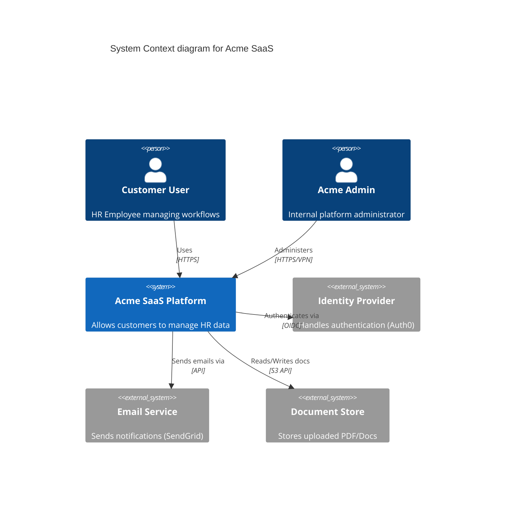

# Architecture: Multi-Tenant B2B SaaS Platform

## 1. System Overview
**Acme SaaS** is a B2B platform allowing organizations to manage HR workflows.
*   **Tenancy Model**: Shared database, shared compute, logical isolation (discriminator column).
*   **Data Sensitivity**: High (PII, Salary Data, Performance Reviews).
*   **Key Requirement**: Strict tenant isolation. Tenant A must NEVER see Tenant B's data.

## 2. Context Diagram (C4 Level 1)



## 3. Container Diagram (C4 Level 2)

```mermaid
C4Container
    title Container diagram for Acme SaaS

    Person(user, "User", "Web Browser")

    Container_Boundary(c1, "Acme Cluster") {
        Container(webApp, "Web App", "React/SPA", "Frontend UI")
        Container(apiGateway, "API Gateway", "Nginx", "Reverse proxy, rate limiting, SSL termination")
        Container(appSvc, "App Service", "Go", "Core business logic, tenant enforcement")
        Container(worker, "Async Worker", "Python", "Background jobs, report generation, file processing")
    }

    ContainerDb(db, "Primary DB", "PostgreSQL", "Stores user data, tenant_id column")
    ContainerDb(cache, "Cache", "Redis", "Session storage, hot data")

    Rel(user, webApp, "Visits", "HTTPS")
    Rel(webApp, apiGateway, "API calls", "JSON/HTTPS")
    Rel(apiGateway, appSvc, "Proxies", "gRPC")
    
    Rel(appSvc, db, "Reads/Writes", "SQL")
    Rel(appSvc, cache, "Reads/Writes", "TCP")
    Rel(appSvc, worker, "Enqueues jobs", "Redis Queue")
    
    Rel(worker, s3, "Process uploads", "HTTPS")
```

## 4. Trust Boundaries & Data Flow
Key trust boundaries identified for Threat Modeling:

1.  **Public/DMZ**: Between User and API Gateway.
2.  **App/Data**: Between App Service and Database.
    *   *Risk*: If App Service is compromised, all tenant data is exposed.
3.  **Worker/External**: Between Worker and S3 (File parsing risks).
4.  **Inter-Service**: Between App Service and Redis/Queue.

## 5. Assets
*   **Tenant Data**: Salary info, PII. (Confidentiality: High)
*   **Authentication Tokens**: JWTs. (Integrity/Confidentiality: High)
*   **Infrastructure Secrets**: DB credentials, API keys. (Confidentiality: Critical)
*   **System Availability**: Uptime for customers. (Availability: High)
